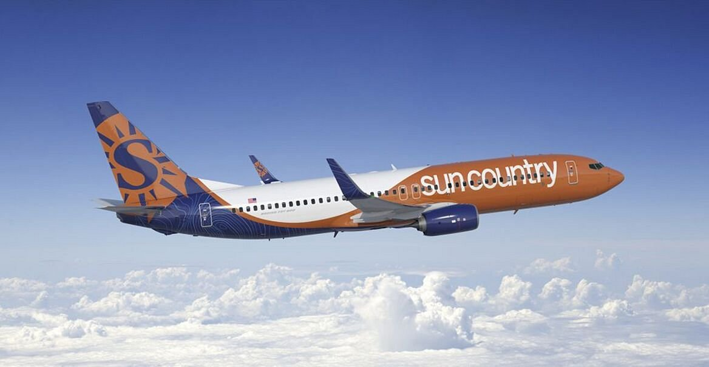

# Sun Country Airlines: Customer Segmentation and Marketing Strategy

This project leverages K-Means clustering to segment customers of Sun Country Airlines and generate targeted marketing strategies based on behavior, spending, booking channels, and loyalty program participation.

## Team Contribution
Worked as part of a team to perform:
- Data preprocessing on over 15,000 rows and 90 features
- K-Means clustering using the Elbow method to find optimal segments
- Marketing recommendations tailored to each customer cluster

## Tools & Libraries
- **Python**: pandas, scikit-learn, matplotlib
- **Google Colab** for collaborative model development
- **K-Means** for segmentation
- **Data Visualization** for cluster insight communication

## Key Insights
- Identified 5 distinct market segments including "The Honeymooners", "Solo Adventurers", and "Last Minute Savers"
- Proposed personalized promotions, bundle strategies, loyalty incentives, and UX improvements
- Enhanced business understanding of price sensitivity and seasonal behavior

## Files Included
- `Project.ipynb`: Full code notebook for preprocessing, clustering, and visualization
- `Sun Country Airlines Report`: Detailed business recommendations and strategic report

## Impact
Helped define actionable loyalty and pricing strategies based on cluster-specific traits, providing a data-driven foundation for personalized marketing.

